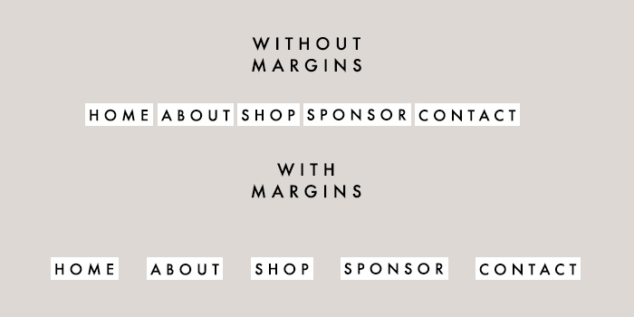

CSS
===

This is a very brief introduction to CSS: how it works and tips on how to iteratively build the style for a webpage.

A CSS file is a text file that contains expressions of the form

```css
selector {
    properties
    ...
}
```

What this file tells the browser (Chrome, Firefox, etc) is that for every HTML element matching the selector, apply the given properties. For example, to style every `<p>` tag in the HTML to have a red background, you could write:

```css
p {
    background: red;
}
```

## Selectors

Here is a brief list of CSS selectors that you can use:

| Selector | Definition | Examples |
| -------- | ---------- | -------- |
| Any HTML tag | All matching HTML tags in the page | `p`, `div`, `h1` |
| .foo | All HTML elements with the class "foo" | `.class-1`, `.ng-app`, `.content` |
| #foo | All HTML elements with the ID "foo" | `#footer`, `#my-custom-id`, `#id-password` |
| foo, bar | All elements matching either the foo selector or the bar selector | `p, h1` matches all p tags and all h1 tags |
| foo bar | All bar elements that are descendants of foo elements | `h1 span` (all spans inside of all h1s), `.column div` (all divs inside of elements with the column class) |
| foo > bar | All bar elements that are direct children of foo elements | h1 > p matches `<h1><p></p></h1>`, but not `<h1><div><p></p></div></h1>` |
| * | Matches anything | `h1 *` all descendents of all `h1` tags |

Note: you can also chain selectors. For example, `p.column.right#sidebar` matches all `p` elements with the classes `column` and `right` and the ID `sidebar`; i.e. any elements that look something like `<p class="column right" id="sidebar">`.

A full list of selectors can be found [here](https://www.w3schools.com/cssref/css_selectors.asp).

## Properties

CSS has a lot of properties that can be set. Here are some of the popular ones:

| Property | Definition | Example values |
| -------- | ---------- | -------------- |
| font-size | The size of the font in the element | `12px`, `1.5em` |
| background | The background of the element | `red`, `#ff00ad`, `url(image.png)` |
| margin | The margin of the element | `10px`, `10px 20px` |
| padding | The padding of the element | `10px`, `10px 20px` |
| width | The width of the element | `200px`, `100%` |
| height | The height of the element | `200px`, `100%` |

A full list of properties can be found [here](https://www.w3schools.com/cssref/)

### Margin vs. Padding

The difference between margin and padding is sometimes semantics, but it can make life a lot easier later on. Think of margin as how much space you want around an element. How far do you want the next element to be from the selected element, at minimum? On the other hand, think of padding as how much space you want inside of an element, between the border of an element and the content inside of it.

A good question to ask is, if you changed the background of the selected element to be bright red, do you want that red background touching neighboring elements? If not, add margin. Additionally, do you want the text to touch the edge of the red background? If not, add padding.




These CSS values can also be specified in multiple ways (same for padding):

```
margin-top: 10px; // adds 10px margin on top of object
margin-bottom: 10px; // adds 10px margin on bottom of object
margin-left: 10px; // adds 10px margin on left of object
margin-right: 10px; // adds 10px margin on right of object

margin: 10px; // adds 10px margin around object
margin: TB LR; // adds first margin to top/bottom, adds second margin to left/right
margin: T LR B;
margin: T R B L; // clockwise starting at top
```

## Cascading Effects

CSS stands for "Cascading Style Sheet". It is defined as "cascading" because properties applied to elements are applied from most specific to least. Let's say you have an element of the form

```html
<div>
    <p>Paragraph 1</p>
    <p class="my-paragraph">Paragraph 2</p>
</div>
```

If you have a stylesheet that looks like:

```css
p {
    font-size: 12px;
}
div p.my-paragraph {
    font-size: 24px;
}
```

Then the first `p` tag will have a font size of 12px, but the second `p` tag will have a font size of 24px, since the selector is more specific than the first.

## Cross-browser

CSS effects are not applied equally between browsers. CSS styling in Chrome might look differently in Firefox. Also, newer CSS properties might not be supported in different browsers (Internet Explorer is the primary culprit here). To check cross-browser compatability, use [caniuse.com](http://caniuse.com). But you still need to check yourself if a page's style looks the same in different browsers.

## Tips

- If you're styling a whole website, put website-wide styles into one CSS file, and page-specific styles into another. That way, you can share one CSS file for every page, keeping a consistent style throughout your site, while not duplicating code.

- To style a new page, start from the bigger layout, going more specific. So to style a page, you'd start out by styling the body. This might involve styling the header section, content section, and footer section. Starting with the header section, style the elements in there so that the header looks the way you want it to look. Then move on to the content section, and then to the footer section.

- You might have CSS references open in another tab a lot in the beginning, but you'll eventually get the hang of how to make the page the way you want it to look.

- Keep in mind to style the page the way the page should behave, not simply what works. For example, if you had a page in the form:

    ```html
    <div>
        <h1>Title</h1>
        <h2>Subtitle</h2>
        <p>Content</p>
    </div>
    ```

    You could set the font sizes separately:

    ```css
    h1 { font-size: 36px; }
    h2 { font-size: 27px; }
    p { font-size: 18px; }
    ```

    But you probably aren't looking to make the `h1` element exactly `36px`; more specifically, you want it to be twice as big as `p`. So you should instead do:

    ```css
    div { font-size: 18px; }
    h1 { font-size: 2em; }
    h2 { font-size: 1.5em; }
    ```

    The first `div` style sets the font size for the entire container (including inside the `p` tag), and then the header tags are relative to that value.

- The web inspector is super helpful; it shows, for a given element, the styles that are being applied to it, and you can even tweak values in the browser!

    - Chrome: View > Developer > Developer Tools, open "Elements" tab
    - Firefox: Tools > Web Developer > Inspector
    - Safari: Develop > Show Web Inspector
